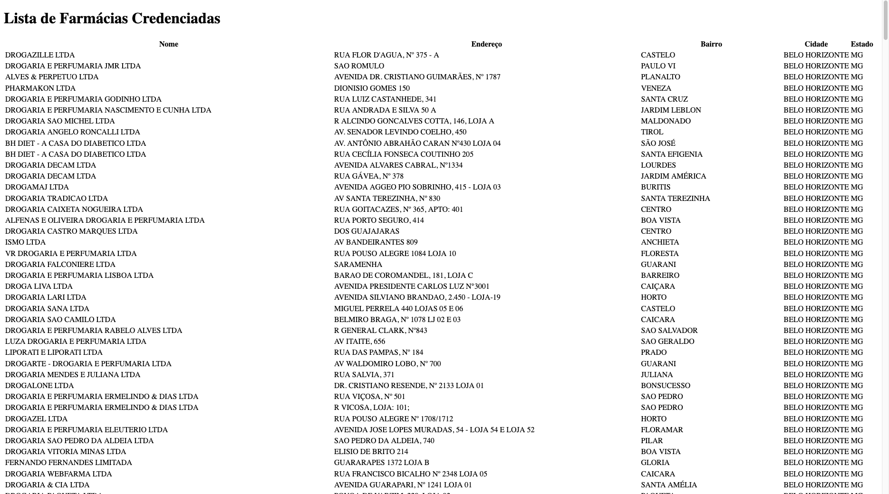

# Ache uma Farmácia Popular

The "Farmácia Popular" Program of Brazil government has a page with accredited
pharmacies, but it is being posted in [xlsx
format](https://www.gov.br/saude/pt-br/composicao/sectics/farmacia-popular/arquivos/farmacias_credenciadas_pfpb_atualizada.xlsx/view),
which is a proprietary format. I want to create a website to allow people to
filter pharmacies closest to their residence.

## Badges

[](https://choosealicense.com/licenses/mit/)


## Development Setup

This project uses [Husky](https://typicode.github.io/husky/) for Git hooks. After cloning the repository:

1. Install dependencies:
```bash
npm install
```

2. Set up Husky:
```bash
npx husky install
```

The pre-configured hooks are:
- `pre-push`: Runs tests before pushing to ensure code quality

To add a new hook:
```bash
npx husky add .husky/<hook-name> "command-to-run"
```

## Demo



## Authors

- [@vagnerclementino](https://www.github.com/vagnerclementino)

## 🚀 About Me

I'm an experienced software developer passionate about empowering individuals
and crafting exceptional code. With a solid background since 2010, I have honed
my Java, Kotlin, Python, and Go skills while delving into Node and Lua
programming languages. Alongside my Master's degree in Software Engineering, I
have achieved significant milestones as a Tech Leader and currently as a Staff
Engineer. My greatest accomplishment lies in nurturing the growth of
individuals, valuing their development as much as the software itself.

## 🔗 Links

[](https://clementino.me)
[](https://www.linkedin.com/in/vclementino)
[](https://www.twitter.com/vclementino)
